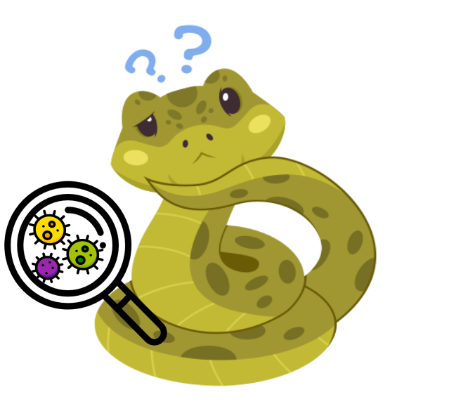

To write

.. contents:: Table of Contents
   :depth: 2
   :backlinks: entry

Viral metagenomics analyses
---------------------------

Snakevir is a workflow developed in snakemake that enables viral metagenomic analysis of short-read data. You can give your own parameters/database in the *config.yaml* file to customize the workflow for your own data.
   
.. warning::
   For the moment, snakevir only searches and analyzes viral data.

Read processing
...............

First, snakevir will process reads. Library adapters and low-quality sequences in reads were removed with Cutadapt. Reads from rRNA sequences from diptera and bacteria were then removed through mapping with BWA against SILVA rRNA bases (bacterial databases: SSURefNr99 and LSURef (release 138), dipteran database, (release 138))

Included tools :

* Cutadapt version == 3.4
* Flash version == 1.2.11
* BWA version == 0.7.17
* samtools version == 1.12
* picard version == 2.25.4

Assembly
.........

The remaining reads were de-novo assembled with Megahit version. The resulting contigs and non-assembled reads were used in a second de-novo assembly with CAP3.

Included tools :

* megahit version == 1.2.9
* cap3 version == 10.2011

Virus identification
....................

A contig was considered a virus-like sequence if a viral sequence was found as the first best hit by Diamond after comparison with the NCBI nr database (e-value cutoff = 10-3). Then, virus-like contigs were screened for sequences potentially derived from endogenous viral elements (EVEs) using BLASTn against NCBI nt (e-value cutoff = 10-3). Contigs with a non-viral best hit with a coverage above 25% were considered as potential EVEs and removed.

Included tools :

* blast version == 2.11.0
* diamond version == 2.0.9

.. warning::
   * For the moment, this workflow doesn't work with diamond version >= 2.1.0 because the taxonmap option change (need to use this option on makeblastdb command).

Counting table
--------------

SnakeVir quantified the number of reads per virus-like contig and library through mapping with BWA. Duplicate reads had been previously removed with the markdup tool in Samtools. Contigs sharing the same best hit were grouped into a viral operational taxonomic unit (vOTU) as previously described.

.. warning::
    ADD a description for coverage 10x

Included tools :

* BWA version == 0.7.17
* samtools version == 1.12
* picard version == 2.25.4

.. note::
    The grouping of viral contigs into a viral operational taxonomic unit (vOTU), as described above, is currently being added.

